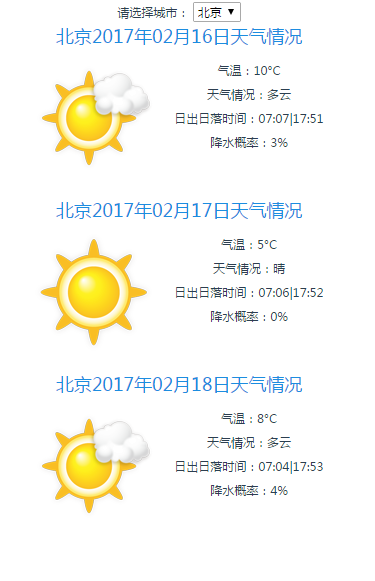

> A Vue.js demo about ChengDu's weather 

### 用vue-cli搭的一个简易的天气查询页面。支持北京/上海/杭州/成都/香港这5个城市的今后3天的天气状况。
### 2017-02-17更新 ：
	利用Echarts实现数据可视化：增加天气折线图。
### [在线demo](https://yokaki.github.io/demos/weather/index.html)


## Build Setup

``` bash
# install dependencies
npm install

# serve with hot reload at localhost:8888 
npm run dev

# build for production with minification
npm run build

# build for production and view the bundle analyzer report
npm run build --report
```


